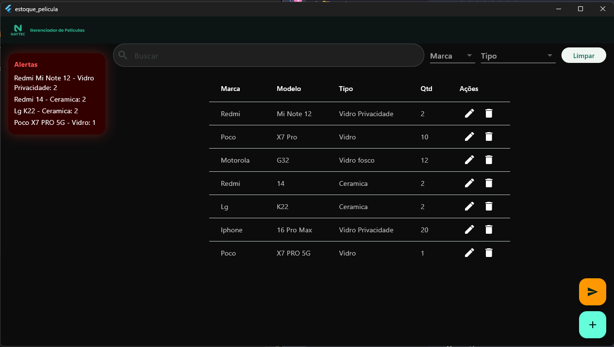
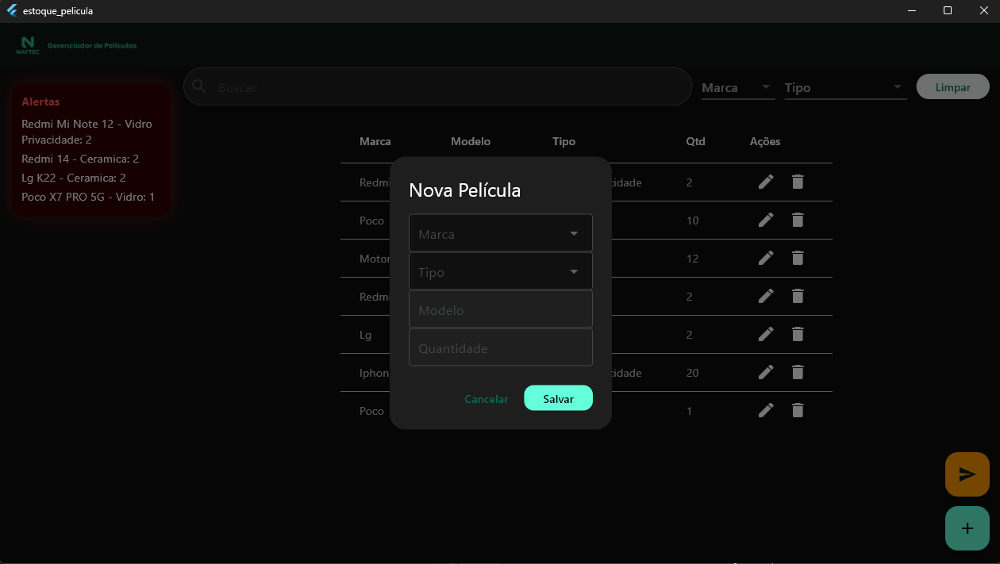
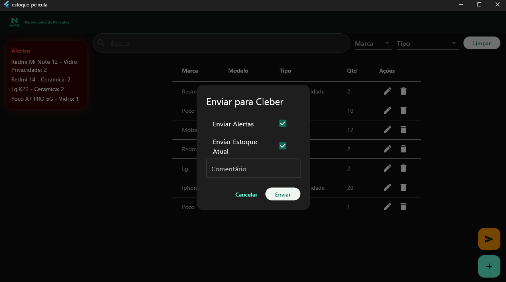

# 📲 Estoque de Películas - NayTec

Gerenciador moderno e visual de estoque de películas NayTec, com alertas automáticos de baixa quantidade, envio por WhatsApp, design escuro, e filtros avançados por Marca e Tipo.


Isso otimizou todo gerenciamento da loja. Uma função que demandava 1 colaborador, e cerca de 2 dias de serviço, agora demora 1 clique no mouse.


---

## 📸 Telas do App

| Tela Inicial | Adicionar Película | Enviar Estoque |
|--------------|--------------------|----------------|
|  |  |  |

---

## 🚀 Como Rodar o Projeto

```bash
# Clone o projeto
git clone https://github.com/seuusuario/estoque_pelicula.git

# Acesse a pasta
cd estoque_pelicula

# Instale as dependências
flutter pub get

# Execute o app
flutter run
```

> ✅ Certifique-se de estar com o Flutter atualizado (`flutter upgrade`).

---

## 📋 Funcionalidades

- 🔍 Filtro de busca, marca e tipo
- ➕ Cadastro de película com dropdowns estilizados
- 🔔 Painel de alerta quando quantidade ≤ 2
- ✏️ Edição de itens
- 🗑️ Remoção de itens
- 📦 Tabela com estoque atual
- 📤 Botão flutuante para envio via WhatsApp formatado

---

## 📞 Envio por WhatsApp

Clique no botão 🟠 laranja no canto inferior:

- Escolha entre:
  - ✅ Enviar alertas
  - 📊 Enviar estoque completo
  - 💬 Adicionar comentário personalizado

Gera link direto para WhatsApp formatado e abre automaticamente para enviar ao Cleber:
```
https://wa.me/5523984601082?text=...
```

---

## 🛠️ Tecnologias Utilizadas

- Flutter 3.x
- GetX para controle de estado
- URL Launcher (`url_launcher`)
- Intl para datas formatadas
- Layout responsivo com dark mode

---

## 🗂️ Organização

```
/lib
  /data
    /models        -> Modelo FilmeModel
  /presentation
    /pages/estoque -> Tela principal EstoquePage
    /controllers   -> GetX Controller do estoque
/assets
  logo.png
  naytec_logo.png
/telas
  1.png, 2.png, 3.png -> Prints
```

---

## 📌 Status do Projeto

> ✅ Projeto 100% funcional e pronto para deploy.
